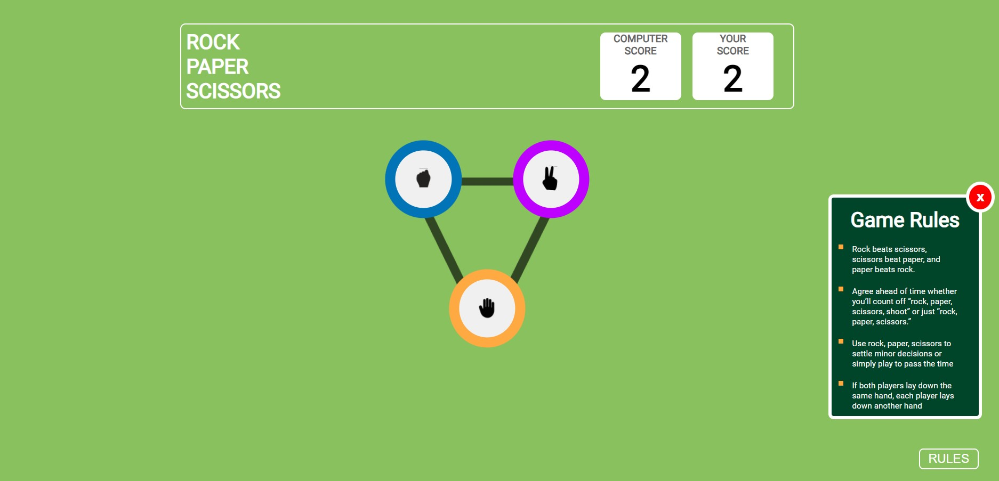

# RockPaperScissors
;

Welcome to the Rock Paper Scissors game! This is a simple web-based game built with HTML, CSS, and JavaScript. In addition to providing an enjoyable gaming experience, this project also incorporates local storage to track and display the player's score.

## Table of Contents

- [Features](#features)
- [Demo](#demo)
- [How to Play](#how-to-play)
- [Installation](#installation)
- [Usage](#usage)
- [Local Storage](#local-storage)

## Features

- Classic Rock Paper Scissors gameplay.
- Fully responsive design, ensuring an optimal experience on all devices.
- Local storage functionality to keep track of the player's score across sessions.

## Demo

You can try the game live at [https://bikashd003.github.io/RockPaperScissors/](#).

## How to Play

1. **Choose Your Weapon**: Click on one of the three icons (rock, paper, or scissors) to make your choice.
2. **Computer's Turn**: The computer will randomly select its weapon.
3. **Outcome**: The winner of the round will be determined based on the classic rules of Rock Paper Scissors:
   - Rock beats scissors
   - Scissors beat paper
   - Paper beats rock
4. **Score**: Your score will be updated based on the outcome of the round.
5. **Play Again**: Click the "Play Again" button to start again.

## Installation

To run this game locally, follow these steps:

1. Clone this repository to your local machine using the following command:

   ```
   git clone https://github.com/your-username/RockPaperScissors.git
   ```

2. Navigate to the project directory:

3. Open the `index.html` file in your preferred web browser.

## Usage

Simply open the `index.html` file in your web browser, and you can start playing the game immediately.

## Local Storage

The game uses local storage to keep track of your score. Your score will persist even if you close the browser or revisit the game later. This means you can compete with yourself and try to beat your previous high score!
